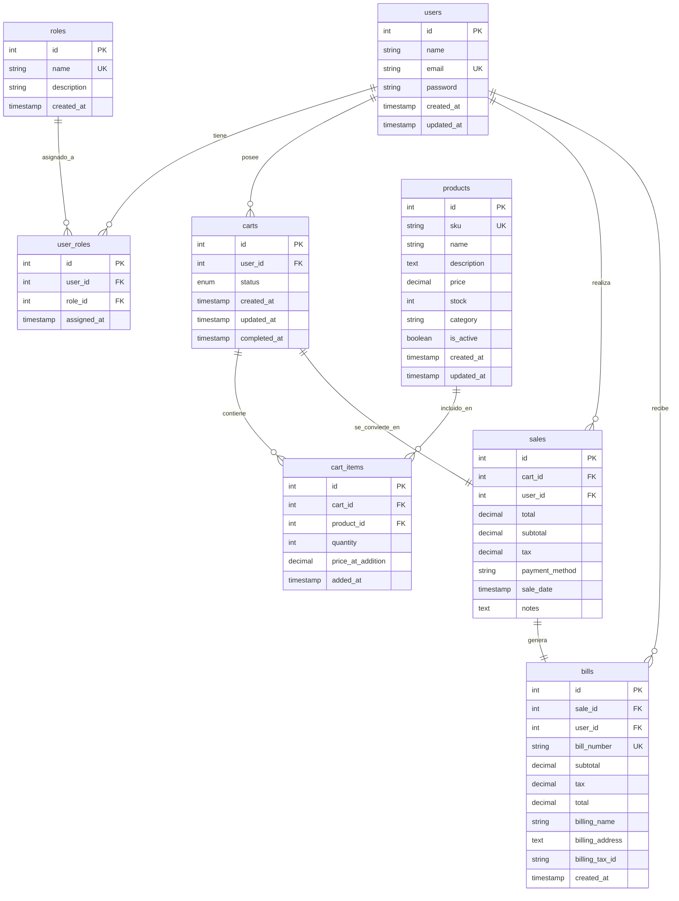

# Diseño de Base de Datos - Pet Shop

## Descripción General

Este documento describe la estructura de la base de datos para el sistema de gestión de la tienda de mascotas. El diseño contempla la gestión de usuarios con roles, catálogo de productos, sistema de carritos de compra, ventas y facturación.

---

## Tablas del Sistema

### 1. users
Almacena la información de los usuarios del sistema.

| Columna | Tipo | Restricciones | Descripción |
|---------|------|---------------|-------------|
| id | INT | PRIMARY KEY, AUTO_INCREMENT | Identificador único del usuario |
| name | VARCHAR(100) | NOT NULL | Nombre completo del usuario |
| email | VARCHAR(150) | NOT NULL, UNIQUE | Correo electrónico (único en el sistema) |
| password | VARCHAR(255) | NOT NULL | Contraseña encriptada |
| created_at | TIMESTAMP | DEFAULT CURRENT_TIMESTAMP | Fecha de creación del registro |
| updated_at | TIMESTAMP | DEFAULT CURRENT_TIMESTAMP ON UPDATE CURRENT_TIMESTAMP | Fecha de última actualización |

**Índices:**
- PRIMARY KEY (id)
- UNIQUE INDEX (email)

**Restricciones especiales:**
- El email debe ser único en todo el sistema
- Un usuario puede tener múltiples roles (relación en tabla user_roles)

---

### 2. roles
Define los roles disponibles en el sistema (admin, cliente, vendedor, etc.).

| Columna | Tipo | Restricciones | Descripción |
|---------|------|---------------|-------------|
| id | INT | PRIMARY KEY, AUTO_INCREMENT | Identificador único del rol |
| name | VARCHAR(50) | NOT NULL, UNIQUE | Nombre del rol (admin, cliente, vendedor) |
| description | VARCHAR(255) | NULL | Descripción del rol |
| created_at | TIMESTAMP | DEFAULT CURRENT_TIMESTAMP | Fecha de creación del registro |

**Índices:**
- PRIMARY KEY (id)
- UNIQUE INDEX (name)

**Roles predefinidos sugeridos:**
- `admin` - Administrador del sistema
- `cliente` - Cliente que realiza compras
- `vendedor` - Empleado que gestiona ventas

---

### 3. user_roles
Tabla intermedia para la relación muchos a muchos entre usuarios y roles.

| Columna | Tipo | Restricciones | Descripción |
|---------|------|---------------|-------------|
| id | INT | PRIMARY KEY, AUTO_INCREMENT | Identificador único de la asignación |
| user_id | INT | NOT NULL, FOREIGN KEY | ID del usuario |
| role_id | INT | NOT NULL, FOREIGN KEY | ID del rol |
| assigned_at | TIMESTAMP | DEFAULT CURRENT_TIMESTAMP | Fecha de asignación del rol |

**Relaciones:**
- user_id → users(id) ON DELETE CASCADE
- role_id → roles(id) ON DELETE CASCADE

**Índices:**
- PRIMARY KEY (id)
- UNIQUE INDEX (user_id, role_id) - Un usuario no puede tener el mismo rol duplicado
- INDEX (user_id)
- INDEX (role_id)

---

### 4. products
Catálogo de productos disponibles en la tienda.

| Columna | Tipo | Restricciones | Descripción |
|---------|------|---------------|-------------|
| id | INT | PRIMARY KEY, AUTO_INCREMENT | Identificador único del producto |
| sku | VARCHAR(50) | NOT NULL, UNIQUE | Código único del producto (Stock Keeping Unit) |
| name | VARCHAR(200) | NOT NULL | Nombre del producto |
| description | TEXT | NULL | Descripción detallada del producto |
| price | DECIMAL(10,2) | NOT NULL | Precio unitario del producto |
| stock | INT | NOT NULL, DEFAULT 0 | Cantidad disponible en inventario |
| category | VARCHAR(100) | NULL | Categoría del producto (alimento, juguete, etc.) |
| is_active | BOOLEAN | DEFAULT TRUE | Indica si el producto está activo |
| created_at | TIMESTAMP | DEFAULT CURRENT_TIMESTAMP | Fecha de creación del registro |
| updated_at | TIMESTAMP | DEFAULT CURRENT_TIMESTAMP ON UPDATE CURRENT_TIMESTAMP | Fecha de última actualización |

**Índices:**
- PRIMARY KEY (id)
- UNIQUE INDEX (sku)
- INDEX (category)
- INDEX (is_active)

**Restricciones especiales:**
- El SKU debe ser único en todo el sistema
- El precio debe ser mayor a 0
- El stock no puede ser negativo

---

### 5. carts
Carritos de compra de los usuarios.

| Columna | Tipo | Restricciones | Descripción |
|---------|------|---------------|-------------|
| id | INT | PRIMARY KEY, AUTO_INCREMENT | Identificador único del carrito |
| user_id | INT | NOT NULL, FOREIGN KEY | ID del usuario propietario |
| status | ENUM('active', 'completed', 'abandoned') | NOT NULL, DEFAULT 'active' | Estado del carrito |
| created_at | TIMESTAMP | DEFAULT CURRENT_TIMESTAMP | Fecha de creación del carrito |
| updated_at | TIMESTAMP | DEFAULT CURRENT_TIMESTAMP ON UPDATE CURRENT_TIMESTAMP | Fecha de última actualización |
| completed_at | TIMESTAMP | NULL | Fecha de finalización (cuando se convierte en venta) |

**Relaciones:**
- user_id → users(id) ON DELETE CASCADE

**Índices:**
- PRIMARY KEY (id)
- INDEX (user_id, status)
- UNIQUE INDEX (user_id) WHERE status='active' - Un usuario solo puede tener un carrito activo

**Restricciones especiales:**
- Un usuario solo puede tener UN carrito con status='active'
- Al completar la venta, el carrito se marca como 'completed', NO se elimina
- Status 'abandoned' para carritos inactivos después de cierto tiempo

---

### 6. cart_items
Productos contenidos en cada carrito.

| Columna | Tipo | Restricciones | Descripción |
|---------|------|---------------|-------------|
| id | INT | PRIMARY KEY, AUTO_INCREMENT | Identificador único del item |
| cart_id | INT | NOT NULL, FOREIGN KEY | ID del carrito |
| product_id | INT | NOT NULL, FOREIGN KEY | ID del producto |
| quantity | INT | NOT NULL, DEFAULT 1 | Cantidad del producto |
| price_at_addition | DECIMAL(10,2) | NOT NULL | Precio del producto al momento de agregarlo |
| added_at | TIMESTAMP | DEFAULT CURRENT_TIMESTAMP | Fecha de adición al carrito |

**Relaciones:**
- cart_id → carts(id) ON DELETE CASCADE
- product_id → products(id) ON DELETE RESTRICT

**Índices:**
- PRIMARY KEY (id)
- INDEX (cart_id)
- INDEX (product_id)
- UNIQUE INDEX (cart_id, product_id) - Un producto no puede estar duplicado en el mismo carrito

**Restricciones especiales:**
- La cantidad debe ser mayor a 0
- Se guarda el precio al momento de agregar (por si el precio cambia después)

---

### 7. sales
Ventas realizadas (carritos finalizados).

| Columna | Tipo | Restricciones | Descripción |
|---------|------|---------------|-------------|
| id | INT | PRIMARY KEY, AUTO_INCREMENT | Identificador único de la venta |
| cart_id | INT | NOT NULL, UNIQUE, FOREIGN KEY | ID del carrito convertido en venta |
| user_id | INT | NOT NULL, FOREIGN KEY | ID del usuario que realizó la compra |
| total | DECIMAL(10,2) | NOT NULL | Monto total de la venta |
| subtotal | DECIMAL(10,2) | NOT NULL | Subtotal antes de impuestos |
| tax | DECIMAL(10,2) | NOT NULL, DEFAULT 0 | Impuestos aplicados |
| payment_method | VARCHAR(50) | NOT NULL | Método de pago (efectivo, tarjeta, transferencia) |
| sale_date | TIMESTAMP | DEFAULT CURRENT_TIMESTAMP | Fecha y hora de la venta |
| notes | TEXT | NULL | Notas adicionales sobre la venta |

**Relaciones:**
- cart_id → carts(id) ON DELETE RESTRICT
- user_id → users(id) ON DELETE RESTRICT

**Índices:**
- PRIMARY KEY (id)
- UNIQUE INDEX (cart_id)
- INDEX (user_id)
- INDEX (sale_date)

**Restricciones especiales:**
- Cada carrito solo puede generar UNA venta
- total = subtotal + tax

---

### 8. bills
Facturas generadas para las ventas.

| Columna | Tipo | Restricciones | Descripción |
|---------|------|---------------|-------------|
| id | INT | PRIMARY KEY, AUTO_INCREMENT | Identificador único de la factura |
| sale_id | INT | NOT NULL, UNIQUE, FOREIGN KEY | ID de la venta asociada |
| user_id | INT | NOT NULL, FOREIGN KEY | ID del usuario (cliente) |
| bill_number | VARCHAR(50) | NOT NULL, UNIQUE | Número de factura (formato: FAC-YYYY-XXXXX) |
| subtotal | DECIMAL(10,2) | NOT NULL | Subtotal de la factura |
| tax | DECIMAL(10,2) | NOT NULL, DEFAULT 0 | Impuestos |
| total | DECIMAL(10,2) | NOT NULL | Total de la factura |
| billing_name | VARCHAR(200) | NOT NULL | Nombre para facturación |
| billing_address | TEXT | NULL | Dirección de facturación |
| billing_tax_id | VARCHAR(50) | NULL | RFC o ID fiscal |
| created_at | TIMESTAMP | DEFAULT CURRENT_TIMESTAMP | Fecha de generación de la factura |

**Relaciones:**
- sale_id → sales(id) ON DELETE RESTRICT
- user_id → users(id) ON DELETE RESTRICT

**Índices:**
- PRIMARY KEY (id)
- UNIQUE INDEX (bill_number)
- UNIQUE INDEX (sale_id)
- INDEX (user_id)

**Restricciones especiales:**
- Una factura está relacionada a un único usuario
- Cada venta solo puede tener UNA factura
- bill_number debe generarse automáticamente en formato estándar

---

## Diagrama Entidad-Relación (ER)

---

## Relaciones Entre Tablas

### Uno a Muchos (1:N)
- **users → carts**: Un usuario puede tener muchos carritos (histórico)
- **users → sales**: Un usuario puede realizar muchas ventas
- **users → bills**: Un usuario puede tener muchas facturas
- **carts → cart_items**: Un carrito puede contener muchos items
- **products → cart_items**: Un producto puede estar en muchos carritos

### Muchos a Muchos (N:M)
- **users ↔ roles**: Un usuario puede tener múltiples roles, un rol puede ser asignado a múltiples usuarios (a través de user_roles)
- **carts ↔ products**: Un carrito puede tener múltiples productos, un producto puede estar en múltiples carritos (a través de cart_items)

### Uno a Uno (1:1)
- **carts → sales**: Un carrito genera una única venta
- **sales → bills**: Una venta genera una única factura

---

## Reglas de Negocio Implementadas

### Usuarios
1. El email debe ser único en todo el sistema
2. Un usuario puede tener múltiples roles
3. Los roles se asignan mediante la tabla intermedia user_roles

### Productos
1. Cada producto tiene un SKU único e irrepetible
2. El stock no puede ser negativo
3. Los productos pueden ser desactivados (soft delete) mediante is_active

### Carritos y Ventas
1. Un usuario solo puede tener UN carrito activo (status='active') a la vez
2. Al finalizar una compra, el carrito NO se elimina, se marca como 'completed'
3. Un carrito completado genera UNA venta
4. Los items del carrito guardan el precio al momento de agregarse (histórico de precios)

### Facturas
1. Una factura está relacionada a un único usuario
2. Cada venta genera una única factura
3. El número de factura es único y se genera automáticamente

---

## Índices y Optimizaciones

### Índices Únicos (UNIQUE)
- users.email
- roles.name
- user_roles(user_id, role_id)
- products.sku
- carts(user_id) WHERE status='active'
- sales.cart_id
- bills.bill_number
- bills.sale_id

### Índices de Búsqueda
- users.id
- carts(user_id, status)
- cart_items.cart_id
- cart_items.product_id
- sales.user_id
- sales.sale_date
- bills.user_id

---

## Notas Técnicas

### Tipos de Datos
- **INT**: Para IDs y cantidades enteras
- **VARCHAR**: Para textos cortos con longitud máxima
- **TEXT**: Para textos largos (descripciones, notas)
- **DECIMAL(10,2)**: Para valores monetarios (10 dígitos totales, 2 decimales)
- **TIMESTAMP**: Para fechas y horas
- **BOOLEAN**: Para valores verdadero/falso
- **ENUM**: Para valores predefinidos con opciones limitadas

### Cascadas y Restricciones
- **ON DELETE CASCADE**: Al eliminar el registro padre, se eliminan los hijos (ejemplo: user → user_roles)
- **ON DELETE RESTRICT**: No permite eliminar el padre si tiene hijos (ejemplo: product en cart_items)
- **UNIQUE INDEX condicional**: Permite implementar "un carrito activo por usuario"

---

## Futuras Extensiones Posibles

1. **Tabla de categorías**: Separar las categorías de productos en su propia tabla
2. **Tabla de direcciones**: Para manejar múltiples direcciones de envío por usuario
3. **Tabla de promociones**: Para descuentos y ofertas especiales
4. **Tabla de devoluciones**: Para gestionar devoluciones de productos
5. **Tabla de reviews**: Para que los usuarios puedan calificar productos
6. **Tabla de pagos**: Para registrar detalles de transacciones de pago
7. **Tabla de inventario**: Para tracking detallado de movimientos de stock
